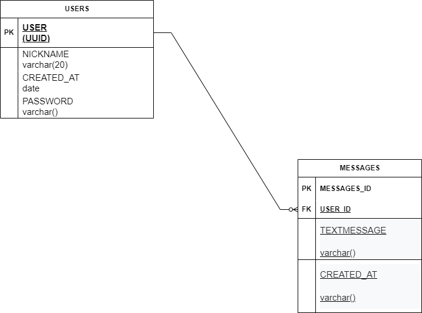

# realtime chat server

url-back:
produção.
front:
realtime-chat-client-react-ohctl4zzz-lucasspindola.vercel.app
link repositorio back end;
https://github.com/Lucasspindola/realtime-chat-server-node

## Tabela de Conteúdos

- [Visão Geral](#1-visão-geral)
- [Diagrama ER](#2-diagrama-er)
- [Início Rápido](#3-início-rápido)
  - [Instalando Dependências](#31-instalando-dependências)

---

## 1. Visão Geral

React JS

---

## 2. Diagrama ER

[ Voltar para o topo ](#tabela-de-conteúdos)

Diagrama ER da API definindo bem as relações entre as tabelas do banco de dados.



---

## 3. Início Rápido

[ Voltar para o topo ](#tabela-de-conteúdos)

### 3.1. Instalando Dependências

Clone o projeto em sua máquina e instale as dependências com o comando:

```shell
yarn
```

```
yarn dev
```

```

```
